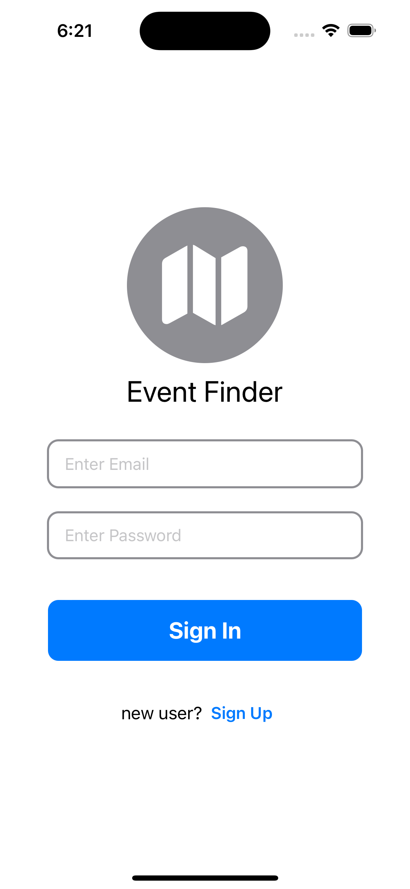
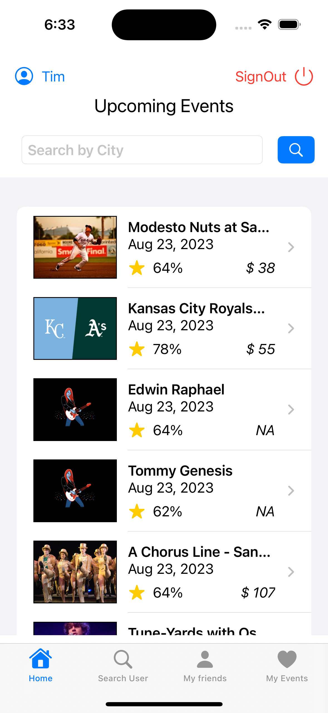
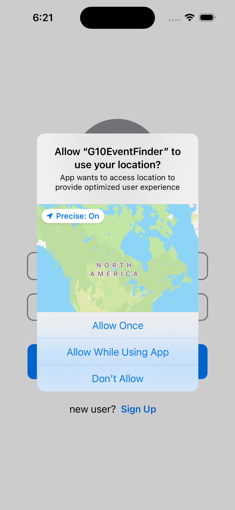
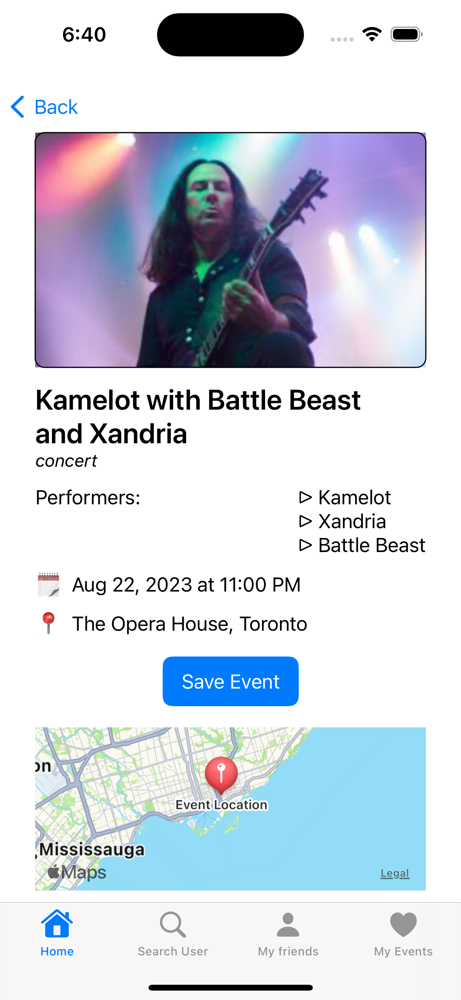
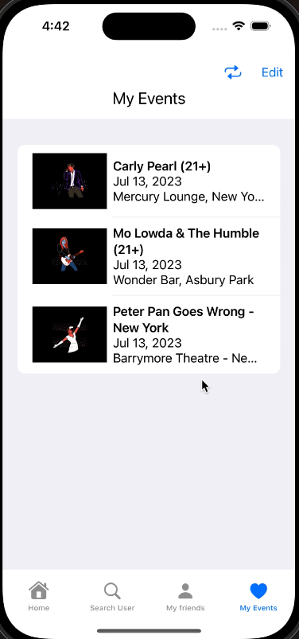
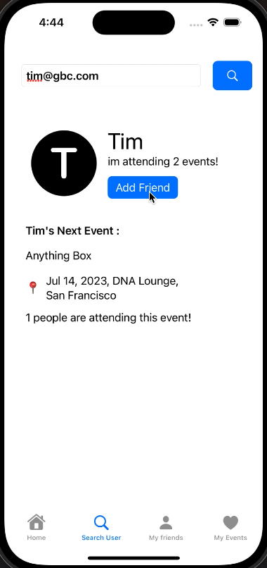
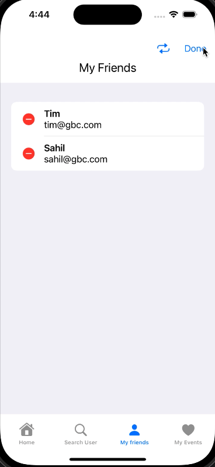
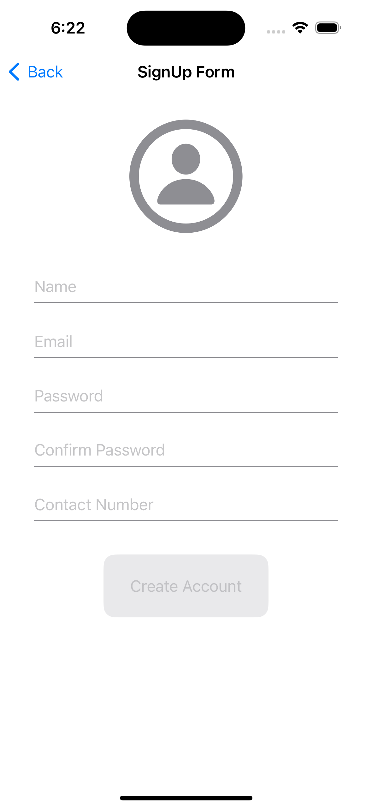

# Event-Finder-iOS
App to explore nearby events, concerts, games, etc. 

    
 
    

## Key Development Concepts
- SwiftUI & Xcode
- CoreData
- Codable and JSON parsing
- GeoCoding & Reverse GeoCoding
- Apple Human Interface Guidelines
- TabView
- Navigation Interface
- User Interface Design (Layout, Views, Modifiers)
- Error Handling and Validation
- Accessibility and Inclusive Design
- Git and Version Control
